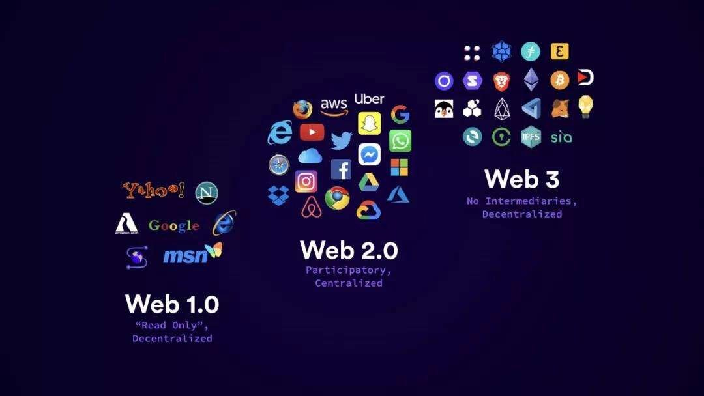
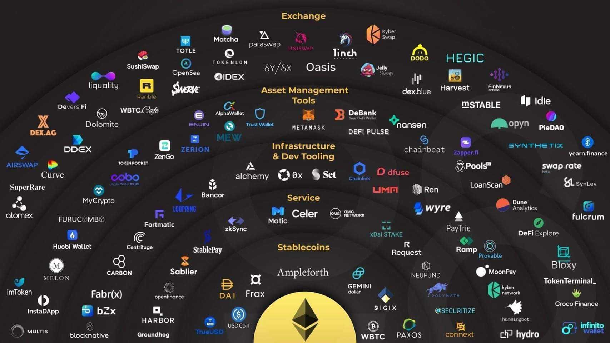

## “Change is inevitable. Change is constant.”  

The web you browse today is not the same it was a decade ago. The World Wide Web is changing, again. But it might not be immediately apparent, given that Tim Berners-Lee’s creation is now an intrinsic part of bilions of life.  We are at the tipping point of a new phase in the web’s evolution. The internet is going through another paradigm shift as we speak. Imagine new type of Web apps that not only accurately interprets what you input, but actually understands everything you convey, whether through text, voice or other media, one where all content you consume is more tailored to you than ever before.

Web 3.0 is slated to be the new paradigm in web interaction and will mark a fundamental change in how developers create websites. There are a few early-stage Web 3.0 applications that already exist today, but until the new internet becomes fully embedded in the web infrastructure, their true potential cannot be observed. 

Web 1.0 refers to the first stage of the World Wide Web evolution, where the huge majority of users were consumers of content. Web 2.0 refers to the World Wide Web which highlights user-generated content. Leading the way for Web 3.0, generally, are those involved in blockchain smart-contract platforms such as Ethereum, Bitcoin, Solona, Icon, EOS one of the largest blockchain-based operating systems in the world.

The major innovation of Web 3.0 networks is the creation of platforms that are decentralized: no single entity controls them but, in theory, everyone can still trust them. As Web 3.0 networks will operate through decentralized protocols — the founding blocks of blockchain and cryptocurrency technology — we can expect to see a strong convergence and symbiotic relationship between these three technologies and other fields. They will be interoperable, seamlessly integrated, automated through smart contracts and used to power anything from micro transactions in Africa, censorship-resistant P2P data file storage and sharing with applications like Filecoin, to completely changing every company conduct and operate their business. The current slew of DeFi protocols are just the tip of the iceberg. 

### To really understand the next stage of the internet, we need to take a look at the four key features of Web 3.0:

<strong>Artificial Intelligence:</strong> Web 3.0 will be integrated with natural language processing to make computers understand human language and provide faster and better results. This is the key to intelligent computation.

<strong>Semantic Web:</strong> Web 3.0 is tightly interlinked with the semantic web. This helps in improving web technologies. Semantic web facilitates to generate content based on the analysis of words by understanding the meaning of each word rather than focusing on keywords.

<strong>Connectivity:</strong> Connectivity is another key feature of Web 3.0. This aims to improve user experience and leverages the usability of all the available information.

<strong>3D Graphics:</strong> 3D graphics has spread across in several fields and it is time it is tightly coupled into web 3.0

<strong>Ubiquity:</strong> The same content will be accessible using multiple applications. Every service will be available over every device and can be accessed from anywhere.

Web 3.0 applications either run on blockchains, decentralized networks of many servers, or a combination of the two that forms crypto economic protocol. These apps are mostly referred to as dapps or decentralized apps and they are open. Customers will seamlessly buy products off of a Web store through smart, contract-enabled distributed applications (dApps) over the blockchain. Through self-executing code, these transactions are immutable and trustless, leading to a reduction in product returns, chargeback fees, and credit card fraud.

These smart, contract-enabled products will be guaranteed by the blockchain to be cryptographically unique and secure, increasing trust between the merchant providing the product and its customers.

<strong>Decentralized finance (DeFi)</strong> is another area that holds great potential. If fintech platforms like mobile payments revolutionized the frontend of finance, we can think of DeFi as revolutionizing the backend – laying new pipes and rails that are easier and more efficient to access, audit and upgrade. Berners-Lee’s idea of allowing programs to interact with the web the same way that people do did not materialize but it looks like the Semantic Web is now coming to life.

Web 3.0 is in many ways a return to Tim Berners-Lee’s Semantic Web, which proposed no limit to access and control of data. Burners-Lee is a computer scientist credited with inventing the World Wide Web. He’s a professor at the Massachusetts Institute of Technology and affiliated with the University of Oxford. In 2001, he published an article in Scientific American giving the world a preview of the revolutionary new changes he saw coming to the web. 

Anyone can build and connect with different dapps without permission from a central company on Web 3.0. There is no central controlling node and no single point of failure. A common requirement for a Web 3.0 application is the ability to digest large-scale information and turn it into factual knowledge and useful executions for users. With that being said, these applications are still at their early stages, which means that they have a lot of room for improvement and are a far cry from  how Web 3.0 apps could potentially function.

The new internet will provide a more personal and customized browsing experience, a smarter and more human-like search assistant, and other decentralized benefits that are hoped will help to establish a more equitable web. This will be achieved by empowering each individual user to become a sovereign over their data, and creating a richer overall experience thanks to the myriad of innovations that is to come once it is in place. Web3 is going to change the face of e-commerce -- there's no doubt about that. However, this technology won't be limited to just those companies that want to use it. In fact, those that don't update their e-commerce platforms to accept cryptocurrencies and NFTs will quickly find themselves losing business as the world moves past what might soon be archaic forms of payment.
