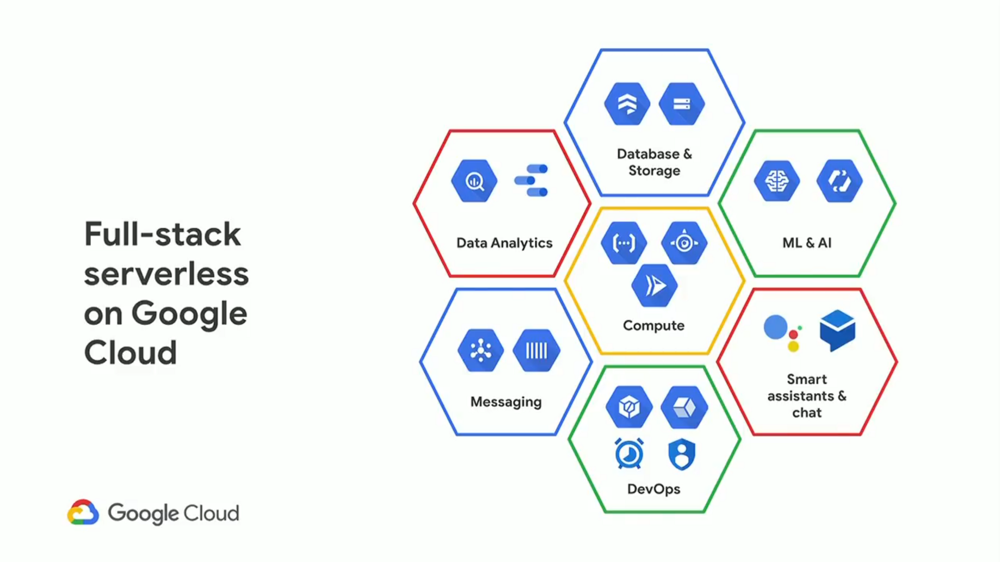

Traditionally, Our application runs on our server and we are responsible for provisioning and managing the resources for it. There are a few issues with this. We are responsible for uptime and maintenance of the server and all its resources. We are also responsible for applying the appropriate security updates to the server. We are charged for keeping the server up even when we are not serving out any requests. As our usage scales we need to manage scaling up our server as well. And as a result manage scaling it down when we don’t have as much usage.

## What is Serverless ?

Serverless computing (or serverless for short), is an execution model where the cloud provider (AWS, Azure, or Google Cloud) is responsible for executing a piece of code by dynamically allocating the resources. And only charging for the amount of resources used to run the code. AWS provides AWS Lambda whereas GCP provides Cloud functiond for deploying our serverless functions.



## Cloud Functions are an easy way to run your code in the cloud

With Cloud Functions, there are no servers to provision, manage, patch, or update. Functions automatically scale and are highly available and fault-tolerant.Cloud Functions are great for building serverless backends, doing real-time data processing, and creating intelligent apps. Google Provides an open source FaaS (Function as a Service) framework based on Express for writing portable Node.js functions.

https://github.com/GoogleCloudPlatform/functions-framework-nodejs

## Getting Started With Cloud Functions

```bash
git clone https://github.com/GoogleCloudPlatform/functions-framework-nodejs.git
```

Go inside the project folder and install dependencies

```bash
yarn install
```

Once you have installed the dependencies, you have to login with you gcp account so that you can deploy your code when it is ready.

```bash
gcloud auth login
gcloud auth application-default login
```

The later command will save your gcp credentials and link it with your project.
Note: Sometimes the cmd based login doesnt work on first attempt so you may have to retry it.

Delete the src folder and create a fresh folder `functions/helloworld`

Inside helloworld folder add this package.json

```js
{
    "name": "@google-cloud/helloworld",
    "version": "1.10.1",
    "description": "FaaS (Function as a service) framework for writing portable Node.js functions",
    "engines": {
      "node": ">=10.0.0"
    },
    "repository": "GoogleCloudPlatform/functions-framework-nodejs",
    "main": "build/src/index.js",
    "types": "build/src/index.d.ts",
    "dependencies": {
      "@firebase/firestore": "^3.1.1",
      "@google-cloud/firestore": "^4.15.1",
      "@google-cloud/functions-framework": "1.9.0",
      "body-parser": "^1.18.3",
      "express": "^4.16.4",
      "minimist": "^1.2.5",
      "on-finished": "^2.3.0",
      "path-to-regexp": "^6.2.0",
      "read-pkg-up": "^7.0.1",
      "semver": "^7.3.5",
    },
    "scripts": {
      "start": "functions-framework",
      "deploy": "gcloud functions deploy --trigger-http --runtime=nodejs10",
      "check": "gts check",
      "clean": "gts clean",
      "compile": "tsc -p .",
      "prepare": "npm run compile",
    },
    "files": [
      "build/src/**/*.js",
      "build/src/**/*.d.ts"
    ],
    "bin": {
      "functions-framework": "./build/src/index.js",
      "functions-framework-nodejs": "./build/src/index.js"
    },
    "author": "Google Inc.",
    "license": "Apache-2.0",
    "devDependencies": {
      "@types/body-parser": "1.19.1",
      "@types/express": "4.17.13",
      "@types/minimist": "1.2.2",
      "@types/mocha": "9.0.0",
      "@types/node": "14.17.21",
      "@types/on-finished": "2.3.1",
      "@types/semver": "^7.3.6",
      "@types/sinon": "^10.0.0",
      "@types/supertest": "2.0.11",
      "gts": "3.1.0",
      "mocha": "9.1.2",
      "pack-n-play": "^1.0.0-2",
      "power-assert": "1.6.1",
      "sinon": "^11.0.0",
      "supertest": "6.1.6",
      "typescript": "4.3.5"
    }
  }

```

Go inside the folder and install dependencies

```js
yarn install
```

Add another file `tsconfig.json`

```js
{
  "extends": "gts/tsconfig-google.json",
  "compilerOptions": {
    "rootDir": ".",
    "outDir": "build",
    "noImplicitAny": false,
  },
  "include": [
    "src/*.ts"]
}

```

Now, inside the same folder, create a nested folder with the name src and add below folder inside the src folder.

`index.ts`

```js
import { helloworld } from './helloworld'

const express = require('express')

// Create an Express object and routes (in order)
const app = express()

// Set our GCF handler to our Express app.
export { app }
export { helloworld }
```

`helloworld.ts`

```js
export async function helloworld(req, res) {
  try {
    let url = req.url
    console.log('url' + url)
    //extract last parameter of the api request url
    url = url
      .split('/')
      .slice(-1)
      .pop()
    url = url.split('?')[0]
    const name = url

    const response = { status: 'SUCCESS', data: name }
    return res.status(200).send(response)
  } catch (error) {
    const errorObj = {}
    errorObj['status'] = "FAILED"
    const message = error
    errorObj['error'] = {
      type: "BAD_REQUEST",
      message: error,
    }
    return res.status(400).send(errorObj)
  }
}
```

Now that you have completed the code for API. Run below command to compile the code into javascript. You should be able to see a build folder in helloworld folder.

```bash
yarn prepare
```

### Testing API Locally

You can test http based cloud functions using postman. Use below command to run the code on local server. Run this command inside helloworld folder.

```bash
yarn start --target=helloworld --port=8080
```

Note: port is optional

Now you can use postman to hit a post request at http://localhost:8080/singh and you should be able to see the passed parameter i.e singh in the the 200 response.

### Deploying Code to GCP

The most important part however is deploying your code to the GCP. Before you proceed with deployment, note that the gcp provides below triggers for a cloud function -

Http trigger (using in current example)
Event based trriggers (https://cloud.google.com/functions/docs/calling)

```bash
gcloud functions deploy helloworld  --trigger-http --runtime=nodejs14
```

It can take upto 2 minutes for a cloud function to get deployed. Once it is deployed, you should be able to see the function in the GCP Cloud functions dashboard and test it using internal test triggers.

Note: You should use API Gateways to define your API endpoints and parameters.

### Further Reading
GCP also provides Firestore Database which we can leverage in our serverless APIs to perform CRUD operations. As your API grows complex, you'd need database at some point of time.

https://cloud.google.com/firestore/docs/manage-data/add-data

