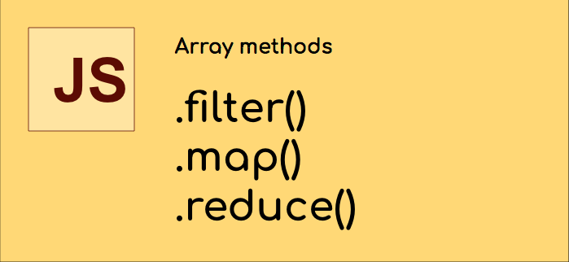
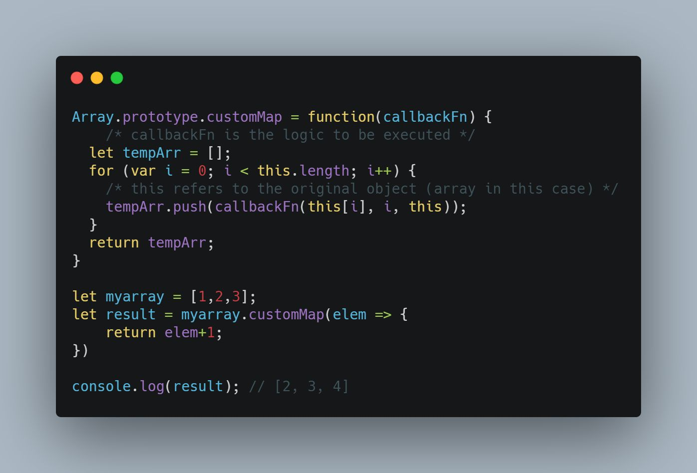
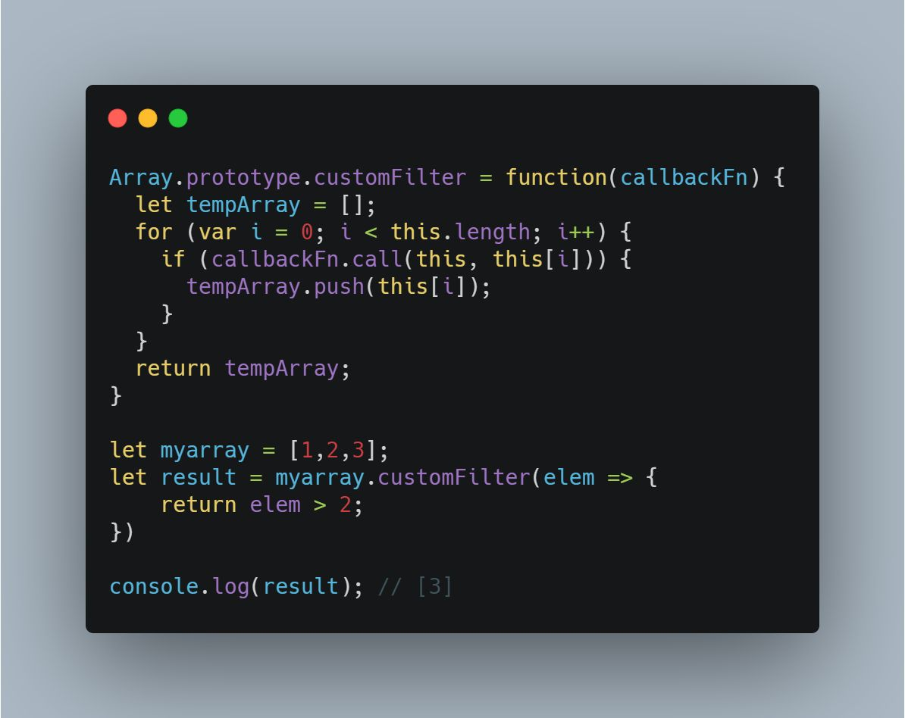
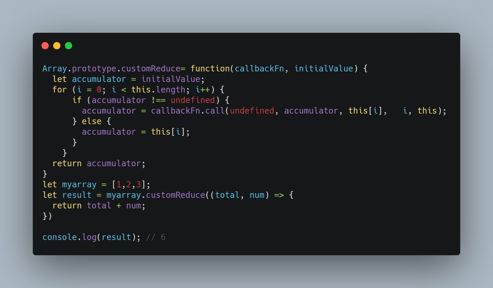

The map, filter and reduce are essentially just some of the most well-known, easy to use, higher-order functions that run provided callback on each element of an array.

All the inbuilt methods are part of Array Prototype and they can can access the array that’s calling the function by referring to the current scope. 

While we all know how to use these methods, it has become a common practice in javascript interviews to ask the candidates to write their own implementation of these functions.

-----

## map

## filter

## reduce

