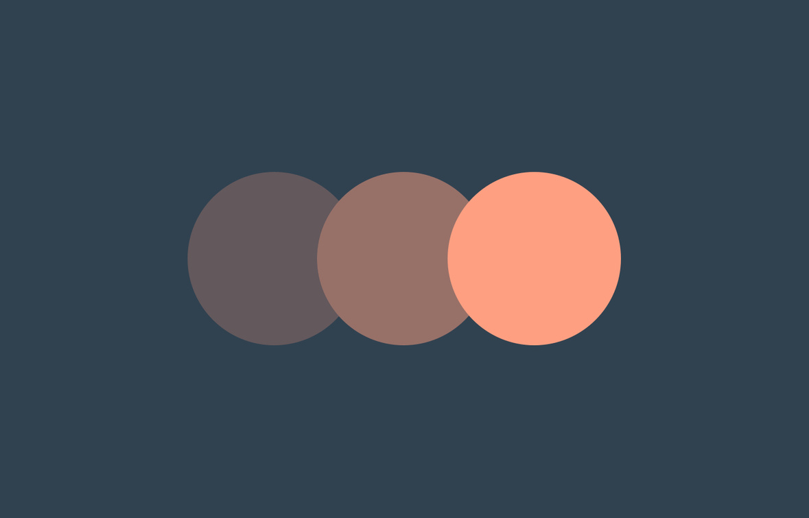

<div class="bigImage">
    
</div>

## Throttling 

Throttling enforces a maximum number of times a function can be called over time. As in 'execute this function at most once every 100 milliseconds.' It essentially let’s you execute a function only once in a given period of time.  If the time duration given is 500 milliseconds, no matter how many times the event is emitted in those 500 milliseconds, the event will only execute once. Assuming an event is fired continuously for 3 seconds, the above example would let the function fire only 6 times.

In cases of continuous event triggers with timely updates needed, this can really come in handy. A fine example for this would be scrolling of the page, and a subsequent function listening to the event to trigger some DOM manipulations.


```js 
function throttle(func, timeFrame) {
  var lastTime = 0;
  return function () {
      var now = new Date();
      if (now - lastTime >= timeFrame) {
          func();
          lastTime = now;
      }
  };
}
```

### Advantages of throttling function:

- It prevent frequent calling of the function.
- It makes the website faster and controls the rate at which a particular function is called.

## Debouncing

Debouncing is a method used in JavaScript to increase browser performance. There may be some features on a web page that needs time-consuming computations. If such type of method is applied frequently, it may greatly affect the browser's performance because Javascript is a single-threaded language. Debouncing is a programming technique that assures that time-consuming activities do not trigger the web page's performance decreases. In other words, the Debounce methods do not run when invoked. Instead, they wait a predetermined period of time until executing. When we call the same process again, the previous process is canceled, and the timer is reset.

It’s very similar to throttle except the time delay is refreshed every time the event is triggered. Again the important part here is that you’re not guaranteed that the function will trigger at least once in the given delay time instead the delay time gets updated every time the function is called. This is particularly useful in cases where the function needs to be fired only once for the final output and previous calls can be ignored in case of continuous triggers.

The general idea for debounce is the following:

- Start with no timeout.
- If the produced function is called, clear and reset the timeout.
- If the timeout is hit, call the original function.

Debounced functions do not execute when invoked, they wait for a pause of invocations over a configurable duration before executing; each new invocation restarts the timer.

Throttled functions execute and then wait a configurable duration before being eligible to fire again.

Debounce is great for keypress events; when the user starts typing and then pauses you submit all the key presses as a single event, thus cutting down on the handling invocations.

Throttle is great for realtime endpoints that you only want to allow the user to invoke once per a set period of time.


<i>Let's assume that an average user types at a pace that the time between consecutive keystrokes is roughly under 300ms. That would mean that if a user takes more than 300ms between two keystrokes, the user has paused. This time can be tweaked to be more realistic for what you think the average speed of typing an individual might have. Now when the user waits longer than 300ms, an API call can be made with the search term. We can translate this into code by making use of the setTimeout method.</i>

```js
let counter = 0;
const getSuggestions = () => {
    //Calls API to get Data
    console.log("Fetching Data...", counter++);
}

const debounce = function (fn, d) {
    let timer;
    return function () {
    let context = this, args = arguments;
    clearTimeout(timer);
    timer = setTimeout(() => {
            fn.apply(context, args);
        }, d)
    }
}

const debounceForData = debounce(getSuggestions, 300);
```

```html
<input type="text" onkeyup="debounceForData()"/>
```

### Dont confuse debounce with settimeout

setTimeout and debounce are in no way the same thing. setTimeout simply waits n milliseconds and the invokes the supplied function. debounce on the other hand returns a function that only calls the callback after n milliseconds after the last time the functions was called.

Debouncing functions are often used to reduced the amount of function calls as a result of user input. Imagine a autocomplete/typeahead field. You might do an ajax request every keystroke, but that can get kind of heavy, so instead you can debounce the function, so it will only fire 200ms after the last keystroke.