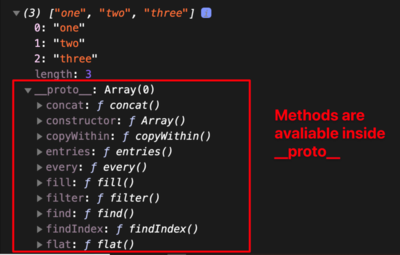

In JavaScript, prototype refers to a system. This system allows you to define properties on objects that can be accessed via the object’s instances. For example, an Array is a blueprint for array instances. You create an array instance with [] or new Array().

```js
const array = ['one', 'two', 'three']
console.log(array);

const array = new Array('one', 'two', 'three');
```
If you console.log this array you won’t see any methods, but you can use methods like concat, slice, filter, and map!

## Explanation 

Because these methods are located in the Array’s prototype. You can expand the proto object (Chrome Devtools) or prototype object (Firefox Devtools) and you’ll see a list of methods.

When you use map, JavaScript looks for map in the object itself. If map is not found, JavaScript will try to look for a Prototype. If JavaScript finds a prototype, it continues to search for map in that prototype.

### So the correct definition for Prototype is: An object that instances can access when they’re trying to look for a property.

<i>As a prototype object is an object, we can attach properties and methods to the prototype object. Thus, enabling all the objects created using the constructor function to share those properties and methods.</i>

---

### Prototype Chains

<b>Step 1</b>: JavaScript checks if the property is available inside the object. If yes, JavaScript uses the property straight away.

<b>Step 2</b>: If the property is NOT inside the object, JavaScript checks if there’s a Prototype available. If there is a Prototype, repeat Step 1 (and check if the property is inside the prototype).

<b>Step 3</b>: If there are no more Prototypes left, and JavaScript cannot find the property, it does returns undefined or throws error depending upon if you called a property or method.