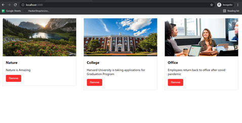

<!--  -->

If you use React in your project, you often pass props from parent to the child components. React data flow is unidirectional. But there could you scenaios where you might need to send data in the reverse order i.e from child to parent. There is no direct way to doing it (unless you use Redux). For example you may need to edit the state of the parent component based on some operation in the child component. In this article, we will discuss how to achieve the same in react using an easy example.

In this tutorial we will develop a simple PhotoApp consisting of Component App and Posts. We will achieve the child to parent dataflow using props callback.



<p><strong>App.js</strong></p>

``` javascript
import React, { Component } from 'react';
import './App.css';
import Posts from './Posts';
import './posts.css';
class App extends Component {
  constructor() {
    super();
    this.state = {
      posts: [
        {
          id: 1,
          title: 'Nature',
          description: 'Nature is Amazing',
          url: 'https://natureconservancy-h.assetsadobe.com/is/image/content/dam/tnc/nature/en/photos/Zugpsitze_mountain.jpg?crop=0,176,3008,1654&wid=4000&hei=2200&scl=0.752'
        },
        {
          id: 2,
          title: 'College',
          description: 'Harvard University is taking applications for Graduation Program',
          url: 'https://2u.com/static/84f4025b19c2bf44a1c9b049994c1eff/5044d/baker-library-harvard-university_OPxWuDn.max-2880x1800.jpg'
        },
        {
          id: 3,
          title: 'Office',
          description: 'Employees return back to office after covid pandemic',
          url: 'https://img-prod-cms-rt-microsoft-com.akamaized.net/cms/api/am/imageFileData/RWptHL?ver=f9a8&q=90&m=2&h=768&w=1024&b=%23FFFFFFFF&aim=true'
        }
      ]
    }
  }

  render() {
  return (
    <div className="App">
      <div class="posts-wrapper">
        <Posts posts={this.state.posts}/>
      </div>
    </div>
  )
  }
}

export default App;

```

As you can probably tell, we are using a post array and storing it inside the state of the App component. We are passing the props to the Posts component.

Now, lets create our posts component.

<p><strong>Posts.js</strong></p>


``` javascript
import React from 'react';

const Posts = props => {
    return (
        props.posts.map(elem => {
            return (
                <div className="posts">
                    
                    <div class="text-container">
                        <h3>{elem.title}</h3>
                        <p>{elem.description}</p>
                        <button className="remove">Remove</button>
                    </div>
                </div>
            )
        })
    )
}

export default Posts;
```

We will need some styling as well to make our posts cards look good. I have created one for you - 

<p><strong>posts.css</strong></p>

``` css
.posts-wrapper {
    display: flex;
    flex-direction: row;
}

.posts-wrapper img {
    max-width: 100%;
    max-height: 200px;
}

h3 {
    margin-bottom: 0;
}

.text-container {
    padding: 0 15px;
    text-align: left;
    border: 1px solid #d3d3d3;
} 

.posts {
    flex-basis: 33.33%;
    display: flex;
    flex-direction: column;
    padding: 20px;
}

.remove {
    appearance: none;
    border: 1px solid #c3c3c3;
    background-color: #ff2c2c;
    color: #fff;
    padding: 10px 15px;
    border-radius: 5px;
    cursor: pointer;
    margin-bottom: 20px;
}
```

Now you should be able to see the Page layout, however nothing happens on click on remove button. Any Guess ? That is because we are not removing the removed post from the state of App component. But wait, our remove button is present in Posts component. We need a way to communicate to the App component which post needs to be removed from posts component.

Lets us create a removePost Function inside our App Component and pass it as a onRemove prop to the Posts component.

``` javascript
import React, { Component } from 'react';
import './App.css';
import Posts from './Posts';
import './posts.css';
class App extends Component {
  constructor() {
    super();
    this.state = {
      posts: [
        {
          id: 1,
          title: 'Nature',
          description: 'Nature is Amazing',
          url: 'https://natureconservancy-h.assetsadobe.com/is/image/content/dam/tnc/nature/en/photos/Zugpsitze_mountain.jpg?crop=0,176,3008,1654&wid=4000&hei=2200&scl=0.752'
        },
        {
          id: 2,
          title: 'College',
          description: 'Harvard University is taking applications for Graduation Program',
          url: 'https://2u.com/static/84f4025b19c2bf44a1c9b049994c1eff/5044d/baker-library-harvard-university_OPxWuDn.max-2880x1800.jpg'
        },
        {
          id: 3,
          title: 'Office',
          description: 'Employees return back to office after covid pandemic',
          url: 'https://img-prod-cms-rt-microsoft-com.akamaized.net/cms/api/am/imageFileData/RWptHL?ver=f9a8&q=90&m=2&h=768&w=1024&b=%23FFFFFFFF&aim=true'
        }
      ]
    }
  }

  removePost = (postid) => {
    let posts = this.state.posts;
    let filteredPosts = posts.filter(elem => elem.id !== postid);
    this.setState({posts: filteredPosts});
  }

  render() {
  return (
    <div className="App">
      <div class="posts-wrapper">
        <Posts posts={this.state.posts} onRemove={this.removePost}/>
      </div>
    </div>
  )
  }
}

export default App;
```

Now that we have the function access as a prop inside the Posts component, we will simply call the function using prop callback along with the id of the post to be removed.

``` javascript
import React from 'react';

const Posts = props => {
    return (
        props.posts.map(elem => {
            return (
                <div className="posts">
                    
                    <div class="text-container">
                        <h3>{elem.title}</h3>
                        <p>{elem.description}</p>
                        <button className="remove" onClick={() => props.onRemove(elem.id)}>Remove</button>
                    </div>
                </div>
            )
        })
    )
}

export default Posts;
```

Simple, isn't it ? Now try to click on remove button and it should work.
