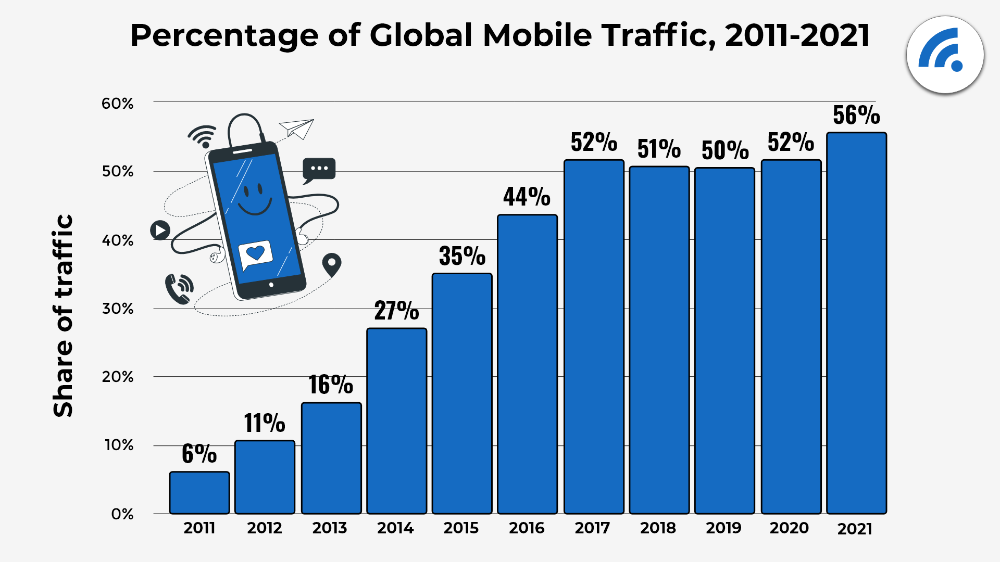

We live in exponential times, and change is happening faster than ever before. We should be prepared for the changes as they will happen faster and more often.

The continuous innovations that have an impact on people follow one another, with an increasingly clear focus on experience and performance. Let's talk about some of the biggest challenges web apps and native mobile apps are facing today -

<strong>Slow loading: </strong> Do you know how long a user waits to click the “Close X” button if a website is taking time to load ? Three seconds! 53% of users leave a website if it is too slow. The average load time for sites is 19 seconds on a 3G connection and 14 seconds on a 4G connection.

<strong>User engagement discrepancy:</strong>  Users spend most of their time in native apps, most of the users are not actively engaged on web. However, users are spending 80% of their time on only their top three native apps. This is despite the fact that mobile web reach is 3 times more than the native apps. Most users are also relucant to download a native apps for minor purpose.

<strong>Internet speed: </strong>  You may not be aware of this depending upon where you live but most of the world is still using 2G and slow 3G. This is a major roadblock for the expansion of web.

Mobile web browsing is a trend that’s here to stay. Mobile web traffic currently makes up 52.6% of global web traffic, which is a 20% increase from five years ago. Most people browse their phone for their daily needs. Whether it be online shopping, looking up directions, or using social media. To help online visibility, it’s important to optimize for mobile as much as possible. There are many ways of doing this. A great option to reach more people is through a Progressive Web App (PWA). 

Progressive Web Apps (PWAs) are today considered the most powerful trend in mobile web development. The technology behind PWA was created by Google and it quickly gained momentum and is now hailed as the future of mobile web development.

## What is a PWA ?

PWA is a website that looks and behaves just like a native mobile app. Users can add it to the main screen of their smartphones. PWAs can send push notifications, access the hardware of the mobile device, and even work offline or in an unstable connection with stored cache. Unlike traditional apps, progressive web apps are a hybrid between regular web pages and mobile applications. The term “progressive” refers to the fact that they introduce new features and, from the user experience’s point of view, they are initially perceived as normal websites but progressively behave more like mobile apps, among other things multiplatform.

There are multiple reasons for using a progressive web app, but here are some of the top capabilities it provides:

<strong>Intuitive user experience: </strong> PWAs feel and behave like native apps as they can be "installed" on mobile device. It does not require App store or playstore listing. They sit in a user’s home screen, send push notifications like native apps, and have access to a device’s functionalities like native apps. The experience feels seamless and integrated.

<strong>Lightning Quick: </strong> From the moment a user downloads an app to the moment they start interacting with it, everything happens really fast. Because you can cache the data, it is extremely fast to start the app again even without hitting the network.

<strong>Reduced Network Dependency: </strong> With the help of service workers, we can reliably perform operations even when the network is not available.

<strong>More engagement: </strong> Since we can send notifications to a user, we can really drive the engagement up by keeping the user notified and engaged with the app.

### Wait... How is this even possible to do with web apps?

The new features of modern browsers that allow PWAs to offer these features are “manifest” and “service workers”

### What exactly is a service worker?

It real key to the advanced experiences that a PWA can offer. A service worker is a script that the browser runs in the background, separated from a web page, to use functions that do not require a web page or user interaction.

Today, SWs already include features such as push notifications and background synchronization. In the future, they will support functions such as periodic synchronization or geofencing. The main function is the ability to intercept and manage network requests, including programmatic management of a cache of responses. It is an API that supports offline experiences by giving developers complete control of the experience.

### Manifest

It is a simple JSON file that defines the basic parameters of PWA, to control how the app should appear to the user and define its appearance at launch: icons, other basic features such as colors, fonts, screen orientation, and the possibility of being installed on the home screen.

<strong>Note:</strong> In order to be a PWA, the web application must be served over a secure network. 

### What Does it Take to Migrate a Website to a PWA?

Since progressive web apps work as a website, make sure you have a well-designed website to begin with. The structure and content must be accurate and up to date. Though you can always make changes, it is a best practice to have your site ready for website migration.

Progressive web apps aren’t code-intensive, but they still require a working knowledge of common languages, like HTML, CSS, and JavaScript.

### Why are Businesses moving to Progressive Web Apps?

Let us consider this scenario where a client wants to launch his/her E-Commerce platform to sell products online. What are things the client will need to reach out to the customers so that the customers can order online?

### Cost of cross platform development

The cost to develop the app for each separate platform adds to the expenditure. Also, adding to it are the fees for publishing the apps to the platforms like the Android Play store and IOS App Store. Thus, this increases the cost to develop as well as the time before the application is open to customers. There is a better option available with the client to move to the Progressive Web Apps. They can act as a website and also as native apps. This method reduces the overall cost and time of development. Both, Native & PWA their own merits as well as demerits. The decision mainly depends on what kind of features you require in your application. For example, PWA may be easier and simpler to install but installing from app store guarantees that the app is free of malware and any insecure code. 

PWA’s are beneficial for a developer, the business and they do not change much of the user experience for the user. From visiting the site, installation prompt to installation takes approximately less than 10 seconds.

Developers need to develop only one codebase. Thus it decreases the cost improves the quality of the end product. No problems with app store integration. There are various guidelines to be followed while publishing your app on the App Store or the PlayStore. But with PWA you don’t need to worry about it and make your app live by just hosting on the server. Download Size is also very less compared to the Native App.

Service workers update the content as soon as the app owner deploys it to the server silently without even the user knowing that it has updated. In Native apps, you need to update manually whenever there are any changes in the app.

It can run on any device which has a browser. If we consider SEO, Search Engines index PWA’s in more detail compared to native apps.

### What are the most used technologies for PWA?

<strong>React:</strong> A powerful JavaScript library for building dynamic and modern user interfaces.

<strong>Polymer:</strong> A combination of components, tools and models designed to create PWA.

<strong>Angular:</strong> A framework for creating dynamic web applications that uses Typescript for development.

<strong>Ionic:</strong> A JavaScript framework for creating powerful applications for multiple platforms using a basic code.

<strong>Accelerated Mobile Pages (AMP):</strong> An open-source project to improve the performance of web pages.

<strong>Svelte:</strong> Last but not the least, svelte remains my top choice for developing PWA due to performance benefits.

### Conclusion 

So, Is the market for Native apps soon going to depreciate? No person can predict the future, and it is uncertain what it may bring for us. Looking at the tech giants like Google, Twitter, Linked In and many others moving towards the Progressive Web Apps approach, the future of PWA seems promising.