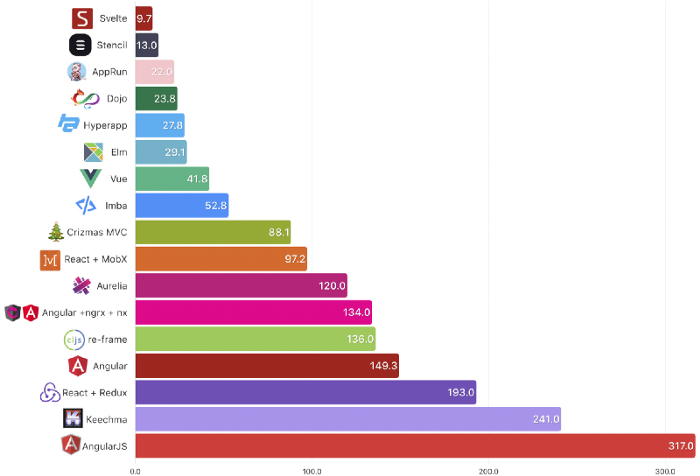
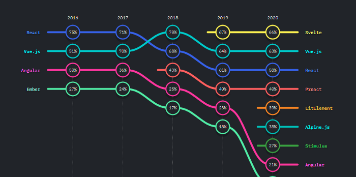

Svelte has been the talk of the town in recent months, and its popularity has risen sharply with version 3. The project has now reached 47k stars on GitHub!. 
While Svelte is gaining popularity as a Single Page Application framework, many developers are still wondering if svelte is a safe choice for making web components?

> Svelte converts your app into ideal JavaScript at build time, rather than interpreting your application code at run time.


<p>

<em>A comparison of the bundle size.</em>
</p>

The bundle size gives svelte an edge over its competitors. This makes it a de-facto choice for the web-development. State of the JS survey predicts that the svelte is already popular among the developers for SPA. However, custom-elements with svelte stills remain unexplored territory. Most developers are unaware of the fact that they can also create web-components using svelte and use it as a plug and play widget.
<p>

<em>State of JS survey 2020</em>
</p>

To make your life easier, I have created a ready to use svelte boilerplate for webcomponents development with good documentation, installation steps and build (Don't forget to star the repo 🙏 )

<a href="https://github.com/tal1992/svelte-webcomponents">Github Repo</a>

<strong>The world’s most easiest, ready to use template for web-components.</strong>

A ready to use project template to build custom elements (web components) with Svelte 3 with support and examples for -

✓ Custom-elements

✓ jest

✓ sass

✓ nested web-components with props

✓eslinting

✓ stylelinting

✓ Github actions

✓ custom events from shadow-DOM to real-DOM

### Installation

``` bash
git clone https://github.com/tal1992/svelte-webcomponents.git
cd svelte-webcomponents 
```

once you are inside the folder, follow the below steps -

```bash
npm install
```

Run build in developer mode -

```bash
npm run dev
```

Run build in production mode -

```bash
npm run build
```

### Using web-components in HTML

```bash
<component-name propOne="Lorem" propTwo="Ipsum"></component-name>
```

### Using web-components as a widget

```js
function addScript(src) {
  var s = document.createElement("script");
  s.setAttribute("src", src);
  document.querySelector("body").appendChild(s);
}
//replace the url with your hosted path of bundle.js
addScript("https://loremipsumdolarsir/build/bundle.js", "", "");
```

Now that your bundle.js file is included in the html , we can use the web components.

```js
let foo = document.createElement('component-foo');
      let header = document.getElementByTagName('header');
      foo.setAttribute('propOne', "lorem");
      foo.setAttribute('propTwo', "Ipsum");
      // please replace header with desired element to place comp.
      header.parentNode.replaceChild(foo, header);
```

